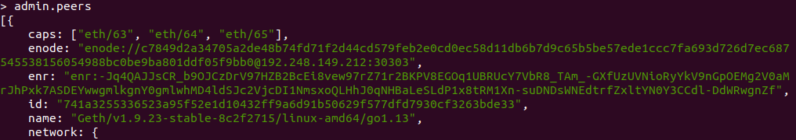

# Connect to ECCPoW Etherem test network

Contents

1. Set up your own node
2. Connect your node to ECCPoW Ethereum test network

Environment

- Linux (Ubuntu, Mint or Manjaro)
- Golang

To install environments, please follow below link

- For Linux: [Link](https://github.com/cryptoecc/ETH-ECC/blob/master/docs/eccpow%20windows%20instuction/Windows%20install%20instruction.md#4-%EB%A6%AC%EB%88%85%EC%8A%A4-%EC%83%81%EC%97%90%EC%84%9C-%EC%8B%A4%ED%96%89-%ED%99%98%EA%B2%BD-%EC%84%A4%EC%A0%95)
- For windows: [Link](https://github.com/cryptoecc/ETH-ECC/blob/master/docs/eccpow%20windows%20instuction/Windows%20install%20instruction.md)

## Set up your node

Before connecting to ECCPoW network, you must set up your own node.

- For connection, you must use same genesis file and network id with ECCPoW Ethereum bootnode.
- Thus, in this chapter, we present how to set up your node with ECCPoW genesis file and network id

1. Clone ECCPoW Ethereum to your directory

```
git clone https://github.com/cryptoecc/ETH-ECC.git
```

If it is done, you can see `ETH-ECC` folder in your directory

2. Make a storage directory 

- In storage directory, blocks and transactions information will be stored

In my case,

```
/document |---- /ETH-ECC
          |---- /storage		  
```

Namely, there exists two directory in document directory

3. Initialize geth

- geth is the name of ECCPoW Ethereum client.

Move to `ETH-ECC` directory, open terminal and type below command to build ECCPoW Ethereum

```
make all
```

After finishing build, move to bin folder. bin folder is located in build directory

```
cd /build/bin
```

For initialize geth, open terminal in bin directory and type below command with replacement

```
./geth --datadir {your_storage_directory} init ../../testnet_genesis/eccpow_test_flight.json
```

In my case,

```
./geth --datadir ../../../storage init ../../testnet_genesis/eccpow_test_flight.json
```

It is end of initialization. In next chapter, we will present how to connect to ECCPoW Ethereum

## Connect your node to ECCPoW Ethereum test network

Open your terminal in bin directory and type below command

```
./geth --datadir {your_storage_directory} --networkid 4478 --bootnodes "enr:-Je4QIe3Ysj0LgoWxCB53l6hIl7rc2varIWKiHr__XH8U-ByBbOfg7-iIlvNdczI2ZKEqifLpPcq5aEMxmtkNMyyZfwBg2V0aMfGhHHGzwGAgmlkgnY0gmlwhKwaEHiJc2VjcDI1NmsxoQM7B5cZBhZyRXChiyqK6vCodk52OAUjdSexXr2Twv8DsYN0Y3CCdmGDdWRwgnZh"

 console
```

- 4478 is network id of ECCPoW Ethereum

In my case

```
./geth --datadir ../../../storage --networkid 4478 --bootnodes"enr:-Je4QIe3Ysj0LgoWxCB53l6hIl7rc2varIWKiHr__XH8U-ByBbOfg7-iIlvNdczI2ZKEqifLpPcq5aEMxmtkNMyyZfwBg2V0aMfGhHHGzwGAgmlkgnY0gmlwhKwaEHiJc2VjcDI1NmsxoQM7B5cZBhZyRXChiyqK6vCodk52OAUjdSexXr2Twv8DsYN0Y3CCdmGDdWRwgnZh"

 console
```

After few seconds, type below command in geth to watch a connected node

```
admin.peers
```

Then, you can see a node such as below figure



---

If you have any question about this instruction, please make a issue in our [Github](https://github.com/cryptoecc/ETH-ECC)

