# Linux install instruction

이 글은 윈도우의 가상머신에 우분투 리눅스를 설치하여, ETH-ECC를 실행하기 위한 환경을 구성하는데 목적을 둠.

목차

1. VMware 다운로드 및 설치
2. 우분투 다운로드
3. VMware 에서 우분투 설치
4. 리눅스 상에서 실행 환경 설정
5. ETH-ECC 다운로드 및 인스톨

## 1. VMware 다운로드 및 설치

https://www.vmware.com/kr/products/workstation-player/workstation-player-evaluation.html

위 링크로 들어가 윈도우용 vmware 다운로드 및 설치

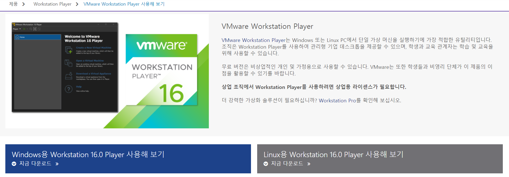

## 2. 우분투 다운로드

https://ubuntu.com/download/desktop

위 링크로 들어가 LTS버전 우분투 다운로드

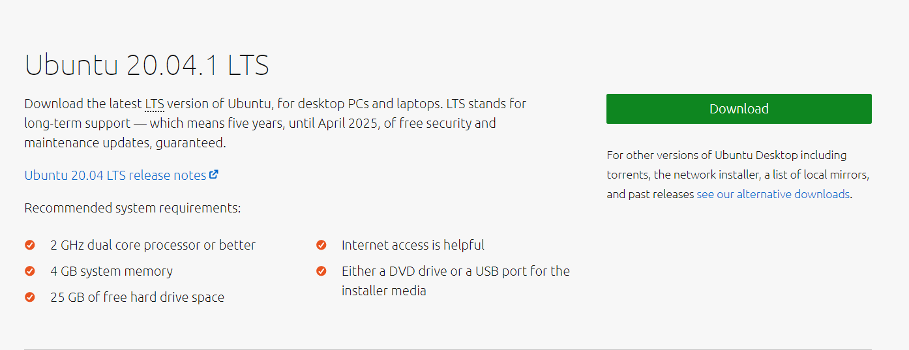

## 3. VMware에서 우분투 설치

1. VMware 실행 후 Create a New Virtual Machine 클릭

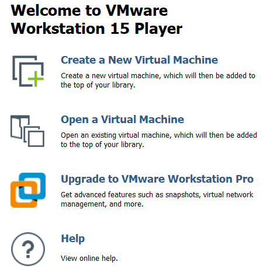

2. 설치한 우분투 선택 후 next 클릭하고 설치 진행

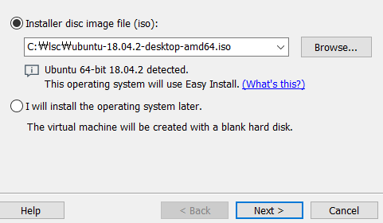


## 4. 리눅스 상에서 실행 환경 설정

1. 설치가 끝나면 리눅스에서 오른쪽 마우스를 클릭하여 터미널 실행 후 패키지 업데이트 및 설치	

  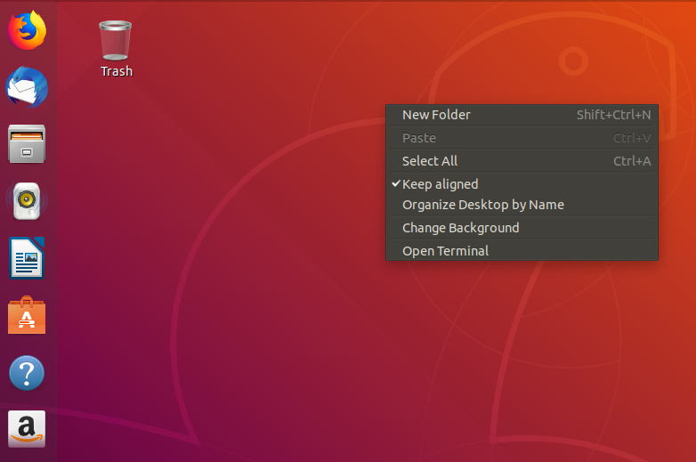

- 패키지 업데이트

  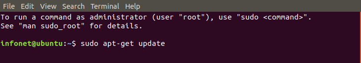

- 고 언어 설치

  

- git 설치

  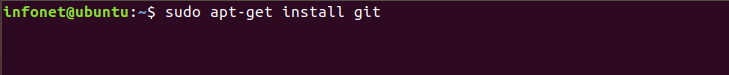

1. 고 언어 설치 후 설치 확인

   - 터미널에서 go env 입력 하여 설치 확인

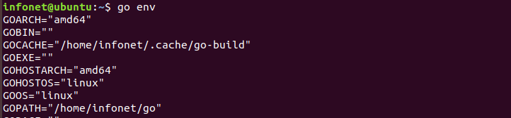

## 5. ETH-ECC 다운로드 및 인스톨

1. ETH-ECC를 설치하기 원하는 위치에서 터미널 실행

  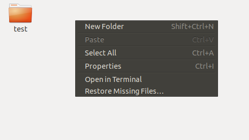

2. 터미널에 명령어 입력하여 ETH-ECC 다운로드

```
git clone https://github.com/cryptoecc/ETH-ECC.git
```

위 커맨드를 터미널에 입력함

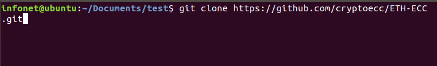

3. 다운로드가 끝나면 다운로드 된 ETH-ECC 폴더로 이동

   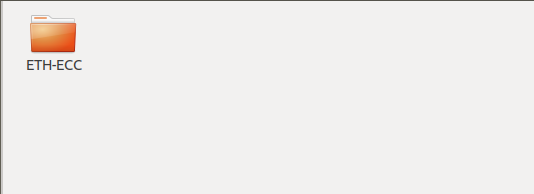

4. ETH-ECC 폴더 안에서 터미널 실행

   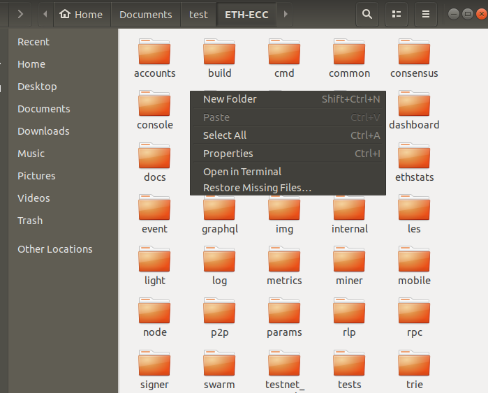

5. 터미널에서 컴파일 실행

   ```
   make all
   ```

   

6. 바이너리 파일이 위치해 있는 build/bin 경로로 이동

   ```
   cd build/bin
   ```

   
   
   
   

---

이후 터미널에서 `./puppeth`를 실행하여  [Build private network and test](https://github.com/cryptoecc/ETH-ECC/blob/master/tutorial.md#21-configuration-of-eth-ecc-environment) 의 2.1단계부터 수행하면 private network 실습이 가능함.

```
./puppeth
```


