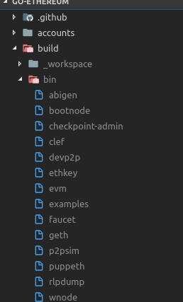
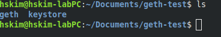
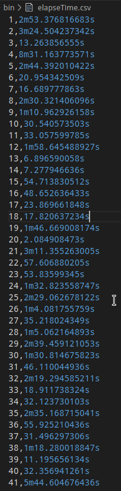

# Build private network and test

Writer : Hyoungsung Kim(김형성)

Email : hyoungsung@gist.ac.kr / rktkek456@gmail.com

Github for this example : https://github.com/cryptoecc/ETH-ECC

For more information : [INFONET](https://infonet.gist.ac.kr/)

- Eth-ECC is an Ethereum blockchain which INFONET has made public at github. The new characteristic of this blockchain is to enable ECCPoW a new protocol for time-varying proof-of-work generation system. 
- This package is designed to run in Linux-environment. For this you need to download and install Linux-mint (see below). If you are Windows users, you need to install the Linux-mint first. If you are Linux users, you may skip this part. 
- Under the assumption that you are in a Linux environment, you may follow this note to proceed. This note is to illustrate how to locate the Eth-ECC package at the github link, download, install, and run Eth-ECC in a local computer.

---

Agenda

1. [Environment](#1.-environment)
   1. [Download](##1.1-download)
   2. [Install](##1.2-install)
2. [Run Eth-ECC in your local computer](#2.-run-eth-ecc-in-your-local-computer)
   1. [Configuration of Eth-ECC network options using puppeth](##2.1-configuration-of-eth-ecc-network-options-using-puppeth)
   2. [Set the directory path for block data stroage](##2.2-set-the-directory-path-for-block-data-stroage)
   3. [Run Eth-ECC](##2.3-run-eth-ecc)
3. [Test Eth-ECC](#3.-test-eth-ecc)
   1. [Basic tests](##3.1-basic-tests)
   2. [Make a transaction for testing private network](##3.2-make-a-transaction-for-testing-private-network)
   3. [(Appendix) Block generation time log](##3.3-(appendix)-block-generation-time-log)

---

## 1. Environment

Eth-ECC package uses the follow two environment

- Linux mint 19.1 or Linux manjaro 19.0.0
- Go (version 1.10 or later) develope language

You can follow two step below to download Eth-ECC and install(build)

### 1.1 Download

Download can be done as follows

- First `clone` Eth-ECC repository to a directory that you want to locate Eth-ECC
- For `clone`, open terminal in the driectory and type command below

```
$ git clone https://github.com/cryptoecc/ETH-ECC.git
```

Then Eth-ECC will be downloaded.

### 1.2 Installation of Eth-ECC

- Installation of Eth-ECC can be done as follows

After download is completed, move to `ETH-ECC` directory, open terminal and type this command

```
$ make all
```

If build is successful then you can see `geth` in /ETH-ECC/build/bin



## 2. Run Eth-ECC in your local computer

In this chapter, we will follow three steps 

- Configure Eth-ECC environment.
  - In order to run Eth-ECC, you need to configure the network settings. They include chainID, network name, and consensus algorithm. This is done with `./puppeth` command.
- Set the directory path for block data stroage
- Run Eth-ECC

### 2.1 Configuration of Eth-ECC environment

- For our network, we have to make a `genesis file` first
  - `genesis file` includes network settings(chainID, network name and consensus algorithm)
- You need to find `puppet` which is located in same directory(/Eth-ECC/build/bin) with `geth`

Run `puppeth` and follow the steps below

```
./puppeth
```

```
[hskim@hskim-pc bin]$ ./puppeth 
+-----------------------------------------------------------+
| Welcome to puppeth, your Ethereum private network manager |
|                                                           |
| This tool lets you create a new Ethereum network down to  |
| the genesis block, bootnodes, miners and ethstats servers |
| without the hassle that it would normally entail.         |
|                                                           |
| Puppeth uses SSH to dial in to remote servers, and builds |
| its network components out of Docker containers using the |
| docker-compose toolset.                                   |
+-----------------------------------------------------------+

Please specify a network name to administer (no spaces, hyphens or capital letters please)
> eccpow1

Sweet, you can set this via --network=eccpow1 next time!

INFO [02-14|21:21:23.414] Administering Ethereum network           name=eccpow1
WARN [02-14|21:21:23.414] No previous configurations found         path=/home/hskim/.puppeth/eccpow1

What would you like to do? (default = stats)
 1. Show network stats
 2. Configure new genesis
 3. Track new remote server
 4. Deploy network components
> 2

What would you like to do? (default = create)
 1. Create new genesis from scratch
 2. Import already existing genesis
> 1

Which consensus engine to use? (default = clique)
 1. Ethash - proof-of-work
 2. Clique - proof-of-authority
 3. EccPoW - proof-of-work with LDPC
> 3

Which accounts should be pre-funded? (advisable at least one)
> 0x

Should the precompile-addresses (0x1 .. 0xff) be pre-funded with 1 wei? (advisable yes)
> 

Specify your chain/network ID if you want an explicit one (default = random)
> 12345
INFO [02-14|21:21:58.917] Configured new genesis block 

What would you like to do? (default = stats)
 1. Show network stats
 2. Manage existing genesis
 3. Track new remote server
 4. Deploy network components
> 2

 1. Modify existing configurations
 2. Export genesis configurations
 3. Remove genesis configuration
> 2

Which folder to save the genesis specs into? (default = current)
  Will create eccpow1.json, eccpow1-aleth.json, eccpow1-harmony.json, eccpow1-parity.json
> 
INFO [02-14|21:22:02.800] Saved native genesis chain spec          path=eccpow1.json
ERROR[02-14|21:22:02.800] Failed to create Aleth chain spec        err="unsupported consensus engine"
ERROR[02-14|21:22:02.800] Failed to create Parity chain spec       err="unsupported consensus engine"
INFO [02-14|21:22:02.803] Saved genesis chain spec                 client=harmony path=eccpow1-harmony.json

What would you like to do? (default = stats)
 1. Show network stats
 2. Manage existing genesis
 3. Track new remote server
 4. Deploy network components
> ^C
```
- `eccpow1` is name of genesis file
  - you can see `eccpow1.json` in directory
- `chainID` is 12345. You can change it, but you have to avoid already defined `chainID`
- You can exit using `ctrl` + `c`

`chainID` is the most important part of this process. Because, geth can recognize a network using `chainID`. In ethereum network, There are already defined `chainIDs`. you can see more detail from [here](https://github.com/ethereumbook/ethereumbook/issues/110)

```
0: Olympic; Ethereum public pre-release testnet
1: Frontier; Homestead, Metropolis, the Ethereum public main network
1: Classic; The (un)forked public Ethereum Classic main network, chain ID 61
1: Expanse; An alternative Ethereum implementation, chain ID 2
2: Morden; The public Ethereum testnet, now Ethereum Classic testnet
3: Ropsten; The public cross-client Ethereum testnet
4: Rinkeby: The public Geth Ethereum testnet
42: Kovan; The public Parity Ethereum testnet
77: Sokol; The public POA testnet
99: POA; The public Proof of Authority Ethereum network
7762959: Musicoin; The music blockchain
```

Except these, you can use any `chainId` like 12345 what i did.

### 2.2 Set the directory path for block data stroage

Now we have to make a directory to store information. I made `geth-test` folder. You can make it anywhere. my directory is `/home/hskim/Documents/geth-test`

Move to `/Eth-ECC/build/bin`, open terminal and follow it

```
$ ./geth --datadir your_own_storage init genesis_file_name.json 
```

For example, in my case

```
(EXAMPLE) $ ./geth --datadir /home/hskim/Documents/geth-test init eccpow1.json 
```

Once the above is initiated, the following terminal message shows up.

```
INFO [08-06|20:49:41.266] Bumping default cache on mainnet         provided=1024 updated=4096
INFO [08-06|20:49:41.268] Maximum peer count                       ETH=50 LES=0 total=50
INFO [08-06|20:49:41.268] Smartcard socket not found, disabling    err="stat /run/pcscd/pcscd.comm: no such file or directory"
INFO [08-06|20:49:41.271] Allocated cache and file handles         database=/home/hskim/Documents/geth-test/geth/chaindata cache=16.00MiB handles=16
INFO [08-06|20:49:41.284] Writing custom genesis block 
INFO [08-06|20:49:41.284] Persisted trie from memory database      nodes=0 size=0.00B time=3.725µs gcnodes=0 gcsize=0.00B gctime=0s livenodes=1 livesize=0.00B
INFO [08-06|20:49:41.285] Successfully wrote genesis state         database=chaindata hash=ab944c…55600c
INFO [08-06|20:49:41.285] Allocated cache and file handles         database=/home/hskim/Documents/geth-test/geth/lightchaindata cache=16.00MiB handles=16
INFO [08-06|20:49:41.302] Writing custom genesis block 
INFO [08-06|20:49:41.302] Persisted trie from memory database      nodes=0 size=0.00B time=3.632µs gcnodes=0 gcsize=0.00B gctime=0s livenodes=1 livesize=0.00B
INFO [08-06|20:49:41.303] Successfully wrote genesis state         database=lightchaindata hash=ab944c…55600c
```

After that, you can see geth and keystore folders in your storage folder:



### 2.3 Run Eth-ECC

Open terminal in `/Eth-ECC/build/bin` and follow it

```
$ ./geth --datadir Your_own_storage --networkid YOUR_NETWORK_ID console
```

We set the `chainid` as 12345 when we make genesis file(In this example, genesis file name is `eccpow1.json`). Therefore our `networkid` is 12345 too

In my case,

```
(EXAMPLE) $ ./geth --datadir /home/hskim/Documents/geth-test --networkid 12345 console
```

Then you can see

```
INFO [08-06|21:27:43.867] Maximum peer count                       ETH=50 LES=0 total=50
INFO [08-06|21:27:43.867] Smartcard socket not found, disabling    err="stat /run/pcscd/pcscd.comm: no such file or directory"
INFO [08-06|21:27:43.870] Starting peer-to-peer node               instance=Geth/v1.9.2-unstable-aa6005b4-20190805/linux-amd64/go1.12.7
INFO [08-06|21:27:43.870] Allocated trie memory caches             clean=256.00MiB dirty=256.00MiB
INFO [08-06|21:27:43.870] Allocated cache and file handles         database=/home/hskim/Documents/geth-test/geth/chaindata cache=512.00MiB handles=524288
INFO [08-06|21:27:43.904] Opened ancient database                  database=/home/hskim/Documents/geth-test/geth/chaindata/ancient
INFO [08-06|21:27:43.904] Initialised chain configuration          config="{ChainID: 12345 Homestead: 0 DAO: <nil> DAOSupport: false EIP150: <nil> EIP155: 0 EIP158: 0 Byzantium: <nil> Constantinople: <nil>  Petersburg: <nil> Engine: unknown}"
INFO [08-06|21:27:43.904] Disk storage enabled for ethash caches   dir=/home/hskim/Documents/geth-test/geth/ethash count=3
INFO [08-06|21:27:43.904] Disk storage enabled for ethash DAGs     dir=/home/hskim/.ethash count=2
INFO [08-06|21:27:43.904] Initialising Ethereum protocol           versions=[63] network=12345 dbversion=7
INFO [08-06|21:27:43.944] Loaded most recent local header          number=0 hash=ab944c…55600c td=400 age=50y3mo3w
INFO [08-06|21:27:43.944] Loaded most recent local full block      number=0 hash=ab944c…55600c td=400 age=50y3mo3w
INFO [08-06|21:27:43.944] Loaded most recent local fast block      number=0 hash=ab944c…55600c td=400 age=50y3mo3w
INFO [08-06|21:27:43.945] Loaded local transaction journal         transactions=0 dropped=0
INFO [08-06|21:27:43.945] Regenerated local transaction journal    transactions=0 accounts=0
INFO [08-06|21:27:43.951] Allocated fast sync bloom                size=512.00MiB
INFO [08-06|21:27:43.951] Initialized fast sync bloom              items=0 errorrate=0.000 elapsed=37.353µs
INFO [08-06|21:27:43.997] New local node record                    seq=3 id=65c5b16ab4aa9e9f ip=127.0.0.1 udp=30303 tcp=30303
INFO [08-06|21:27:43.998] Started P2P networking                   self=enode://3e6e6cc9fd56954e02f3807813e086827ddf0576d0c969f67a915691ec3f879867332ba4911048fd513672856c63a2746063706005c6d777f670ae16c2c4a384@127.0.0.1:30303
INFO [08-06|21:27:43.999] IPC endpoint opened                      url=/home/hskim/Documents/geth-test/geth.ipc
WARN [08-06|21:27:44.088] Served eth_coinbase                      reqid=3 t=16.874µs err="etherbase must be explicitly specified"
Welcome to the Geth JavaScript console!

instance: Geth/v1.9.2-unstable-aa6005b4-20190805/linux-amd64/go1.12.7
at block: 0 (Thu, 01 Jan 1970 09:00:00 KST)
 datadir: /home/hskim/Documents/geth-test
 modules: admin:1.0 debug:1.0 eth:1.0 ethash:1.0 miner:1.0 net:1.0 personal:1.0 rpc:1.0 txpool:1.0 web3:1.0
>
```

At last line, you can see console pointer(>).

There are some lines of the box above that we need to check 

```
INFO [08-06|21:27:43.904] Initialised chain configuration          config="{ChainID: 12345 Homestead: 0 DAO: <nil> DAOSupport: false EIP150: <nil> EIP155: 0 EIP158: 0 Byzantium: <nil> Constantinople: <nil>  Petersburg: <nil> Engine: unknown}"
```

In this line, we can check ChainID is 12345.

Now our Eth-ECC network is running!

## 3. Test Eth-ECC

1. Basic tests
   - We will make an account, mine block and check result of mining
2. Make a transaction
3. (Appendix) Block generation time log

### 3.1 Basic tests

In this test, we will follow 3 steps

- Generate account
- Check account's balance
- Mining

Now let's test our private network

```
> eth.blockNumber
0
> eth.accounts
[]
```

`eth.blockNumber` check the number of blocks. We just generate this network. Therefore there is 0 block. `eth.account` check accounts of network. There are no accounts.

#### Generate account

Let's generate account

```
> personal.newAccount("Alice")
INFO [08-06|21:33:36.241] Your new key was generated               address=0xb8C941069cC2B71B1a00dB15E6E00A200d387039
WARN [08-06|21:33:36.241] Please backup your key file!             path=/home/hskim/Documents/geth-test/keystore/UTC--2019-08-06T12-33-34.442823142Z--b8c941069cc2b71b1a00db15e6e00a200d387039
WARN [08-06|21:33:36.241] Please remember your password! 
"0xb8c941069cc2b71b1a00db15e6e00a200d387039"
```

We just generated the address of Alice:`0xb8C941069cC2B71B1a00dB15E6E00A200d387039`. We can check using geth

```
> eth.accounts
["0xb8c941069cc2b71b1a00db15e6e00a200d387039"]
```

we will use it as miner's address so block generation reward will be sent to Alice's address

#### Check account's balance

Before mining, let's check Alice's balance

```
> eth.getBalance("0xb8c941069cc2b71b1a00db15e6e00a200d387039")
0
> eth.getBalance(eth.accounts[0])
0
```

There are 2 ways to check balance.

	- First, using address directly
	- Second, using random access of `eth.accounts`. Alice's account is first account of our network. so we can call it as `eth.account[0]`

I will use first one in this example to avoid confusion.

As we expect, there is no ether at all. Let's do mining.

#### Mining

First we have to set miner's address. For this, we will use 3 commands

- miner.setEtherbase(address)
  - It sets miner's address. Mining reward will be sent to this account
- miner.start(number of threads)
  - Start mining. You can set how many threads you will use. I will use 1 thread
  - If your CPU has enough core, you can use higher number. It will work faster.
- miner.stop()
  - Stop mining

```
> miner.setEtherbase("0xb8c941069cc2b71b1a00db15e6e00a200d387039")
true
> miner.start(1)
null
INFO [08-06|21:42:38.198] Updated mining threads                   threads=1
INFO [08-06|21:42:38.198] Transaction pool price threshold updated price=1000000000
null
> INFO [08-06|21:42:38.198] Commit new mining work                   number=1 sealhash=4bb421…3f463a uncles=0 txs=0 gas=0 fees=0 elapsed=325.066µs
INFO [08-06|21:42:40.752] Successfully sealed new block            number=1 sealhash=4bb421…3f463a hash=4b2b78…4808f6 elapsed=2.554s
INFO [08-06|21:42:40.752] 🔨 mined potential block                  number=1 hash=4b2b78…4808f6

.
.
.

INFO [08-06|21:42:56.174] 🔨 mined potential block                  number=9 hash=2faebb…8be693
INFO [08-06|21:42:56.174] Commit new mining work                   number=10 sealhash=384aa6…cb0596 uncles=0 txs=0 gas=0 fees=0 elapsed=179.463µs
> miner.stop()
null
```

We finished mining. Now let's check it worked well.

```
> eth.blockNumber
9
```

In my case, I mined 9 blocks until I stop it.

```
> eth.getBalance("0xb8c941069cc2b71b1a00db15e6e00a200d387039")
45000000000000000000
```

Wow! we got a reward. Exactly `wei`, not `ether`. wei is small unit of ether like satoshi of bitcoin

```
1 ether = 10^18 wei
```

We can convert it to ether by command

```
> web3.fromWei(eth.getBalance("0xb8c941069cc2b71b1a00db15e6e00a200d387039"), "ether")
45
```

Yeah! we got 45 ether. But why 45 ether? To know it, we have to see the source code of geth(go-ethereum)

```go
//go-ethereum/consensus/ethash/consensus.go
func accumulateRewards(config *params.ChainConfig, state *state.StateDB, header *types.Header, uncles []*types.Header) {
	// Select the correct block reward based on chain progression
	blockReward := FrontierBlockReward
	if config.IsByzantium(header.Number) {
		blockReward = ByzantiumBlockReward
	}
	if config.IsConstantinople(header.Number) {
		blockReward = ConstantinopleBlockReward
	}
	// Accumulate the rewards for the miner and any included uncles
	reward := new(big.Int).Set(blockReward)
	r := new(big.Int)
	for _, uncle := range uncles {
		r.Add(uncle.Number, big8)
		r.Sub(r, header.Number)
		r.Mul(r, blockReward)
		r.Div(r, big8)
		state.AddBalance(uncle.Coinbase, r)

		r.Div(blockReward, big32)
		reward.Add(reward, r)
	}
	state.AddBalance(header.Coinbase, reward)
}
```

In this function, `blockReward` is initialized as `FrontierBlockReward`.

Let's see what is `FrontierBlockReward`

```go
//go-ethereum/consensus/ethash/consensus.go
var (
	FrontierBlockReward       = big.NewInt(5e+18) // Block reward in wei for successfully mining a block
	ByzantiumBlockReward      = big.NewInt(3e+18) // Block reward in wei for successfully mining a block upward from Byzantium
	ConstantinopleBlockReward = big.NewInt(2e+18) // Block reward in wei for successfully mining a block upward from Constantinople
	maxUncles                 = 2                 // Maximum number of uncles allowed in a single block
	allowedFutureBlockTime    = 15 * time.Second  // Max time from current time allowed for blocks, before they're considered future blocks
.
.
.
)
```

`FrontierBlockReward` is set as 5 * 10^18 and it is 5 ether. Alice generated 9 blocks and got 5 ether per generation. Therefore Alice got 45 ether.

### 3.2 Make a transaction for testing private network

In this section, we want to generate transaction and send ether

- We will make a new account(Bob) and will send ether from miner(Alice) to new account(Bob)

Generate new account

```
> personal.newAccout("Bob")
INFO [08-06|22:00:23.416] Your new key was generated               address=0xf39Cf42Cd233261cd2b45ADf8fb1E5A1e61A6f90
WARN [08-06|22:00:23.416] Please backup your key file!             path=/home/hskim/Documents/geth-test/keystore/UTC--2019-08-06T13-00-21.621172635Z--f39cf42cd233261cd2b45adf8fb1e5a1e61a6f90
WARN [08-06|22:00:23.416] Please remember your password! 
"0xf39cf42cd233261cd2b45adf8fb1e5a1e61a6f90"

> eth.getBalance("0xf39cf42cd233261cd2b45adf8fb1e5a1e61a6f90")
0
```

I got account of Bob:`0xf39cf42cd233261cd2b45adf8fb1e5a1e61a6f90` Alice will send ether to Bob's account

```
> eth.sendTransaction({from: "0xb8c941069cc2b71b1a00db15e6e00a200d387039", to: "0xf39cf42cd233261cd2b45adf8fb1e5a1e61a6f90", value: web3.toWei(5, "ether")})
```

Let's send 5 ether to Bob's account

- Alice's account : `0xb8c941069cc2b71b1a00db15e6e00a200d387039`
- Bob's account : `0xf39cf42cd233261cd2b45adf8fb1e5a1e61a6f90`

Or we can initialize these using variable

```
> from = "0xb8c941069cc2b71b1a00db15e6e00a200d387039"
> to = "0xb8c941069cc2b71b1a00db15e6e00a200d387039"
> eth.sendTransaction({from: from, to: to, value: web3.toWei(5, "ether")})
```

We have to unlock Alice's account. Let's see status of Alice's account.

```
> personal.listWallets[0].status
"Locked"
```

Yes It is locked. So we have to unlock it to send ether from Alice to Bob

```
> web3.personal.unlockAccount("0xb8c941069cc2b71b1a00db15e6e00a200d387039")
Unlock account 0xb8c941069cc2b71b1a00db15e6e00a200d387039
```

Alice's address is `0xb8c941069cc2b71b1a00db15e6e00a200d387039`. However we have to type a `Passphrase` of Alice. `passphrase` is `Alice` cause we generate this address using `Alice`

>Remember it!
>
>```
>> personal.newAccount("Alice")
>```

```
Passphrase: Alice
true
```

Now Alice's account is unlocked. Let's go back to transaction. We can see pending transactions

```
> eth.pendingTransactions
[]
```

Until now, there is not any transaction. We just unlocked Alice's account. Let's make a transaction again.

```
> eth.sendTransaction({from: "0xb8c941069cc2b71b1a00db15e6e00a200d387039", to: "0xf39cf42cd233261cd2b45adf8fb1e5a1e61a6f90", value: web3.toWei(5, "ether")})
INFO [08-06|22:16:09.274] Setting new local account                address=0xb8C941069cC2B71B1a00dB15E6E00A200d387039
INFO [08-06|22:16:09.275] Submitted transaction                    fullhash=0x926f1bb71d5b48a306e6cde2d45c01f8af2107febf94b166a7e5f8e025dc8adc recipient=0xf39Cf42Cd233261cd2b45ADf8fb1E5A1e61A6f90
"0x926f1bb71d5b48a306e6cde2d45c01f8af2107febf94b166a7e5f8e025dc8adc"
```

There is no error. Let's see a pending transactions

```
> eth.pendingTransactions
[{
    blockHash: null,
    blockNumber: null,
    from: "0xb8c941069cc2b71b1a00db15e6e00a200d387039",
    gas: 21000,
    gasPrice: 1000000000,
    hash: "0x926f1bb71d5b48a306e6cde2d45c01f8af2107febf94b166a7e5f8e025dc8adc",
    input: "0x",
    nonce: 0,
    r: "0x70484271bdc85f7233e715423d8d0be5c669a323385b5ec0ff080a52cf3c654c",
    s: "0x1b55a792995f61128c10a48ce1e0869893c863d38489f574d84ae3a96b031cef",
    to: "0xf39cf42cd233261cd2b45adf8fb1e5a1e61a6f90",
    transactionIndex: null,
    v: "0x42",
    value: 5000000000000000000
}]
```

There is transaction.

```
> eth.getBalance("0xb8c941069cc2b71b1a00db15e6e00a200d387039")
45000000000000000000
> eth.getBalance("0xf39cf42cd233261cd2b45adf8fb1e5a1e61a6f90")
0
```

We didn't mine any block. so There is no change of balance yet. Let's mine again!

```
> miner.start(1)
INFO [08-06|22:19:53.061] Updated mining threads                   threads=1
INFO [08-06|22:19:53.061] Transaction pool price threshold updated price=1000000000
null
> INFO [08-06|22:19:53.062] Commit new mining work                   number=10 sealhash=f69cfb…273c0d uncles=0 txs=0 gas=0 fees=0 elapsed=265.557µs
INFO [08-06|22:19:53.062] Commit new mining work                   number=10 sealhash=a018f5…65f494 uncles=0 txs=1 gas=21000 fees=2.1e-05 elapsed=1.022ms
INFO [08-06|22:19:54.718] Successfully sealed new block            number=10 sealhash=a018f5…

.
.
.

INFO [08-06|22:20:05.086] 🔨 mined potential block                  number=16 hash=e7688a…09ed64
INFO [08-06|22:20:05.086] Commit new mining work                   number=17 sealhash=6b297d…b76b19 uncles=0 txs=0 gas=0     fees=0       elapsed=252.945µs
> miner.stop()
null
```

```
> eth.blockNumber
16
```

Last time Alice mined 9 blocks and this time mined 7 blocks more. So We can expect Alice has 75 ether (80 ether block reward - 5 ether sent to Bob = 75 ether). Let's check.

First,

```
> eth.pendingTransactions
[]
```

There is no pending transaction. Alice and Bob's transaction is done!

Let's see balance of them

```
> eth.getBalance("0xb8c941069cc2b71b1a00db15e6e00a200d387039")
75000000000000000000
> eth.getBalance("0xf39cf42cd233261cd2b45adf8fb1e5a1e61a6f90")
5000000000000000000
```

As we expected, Alice has 75 ether, Bob has 5 ether. We did it!

### 3.3 (Appendix) Block generation time log

When you want to record the log of block generation time of Eth-ECC, then follow step below

> I added few lines of source code in miner/worker.go
>
> (For this you have to uncomment in in miner/worker.go)
>
> ```go
> csvFile, _ := os.OpenFile("elapseTime.csv", os.O_WRONLY|os.O_CREATE|os.O_APPEND, 0644)
> 
> wr := csv.NewWriter(csvFile)
> wr.Write([]string{block.Number().String(), time.Since(task.createdAt).String()})
> wr.Flush()
> ```
>
> This source will make `elapseTime.csv` file in /build/bin directory(Same directory with `geth` and `puppeth`).
> In this file, block generation time will be written by source code.
> You can see a example below



- 1, 2, ... ,41 is block height
- 2m53.376, 3m24.504... , 5m44.6046 is elapsed time(block generation time)

---

If there are errors or you want to add more details, please make a issue in my github or official Eth-ECC gitbub

Github :

- Official : https://github.com/cryptoecc/ETH-ECC
- Writer : https://github.com/HyoungsungKim/Studying-ethereum/tree/master/study-in-geth/docs